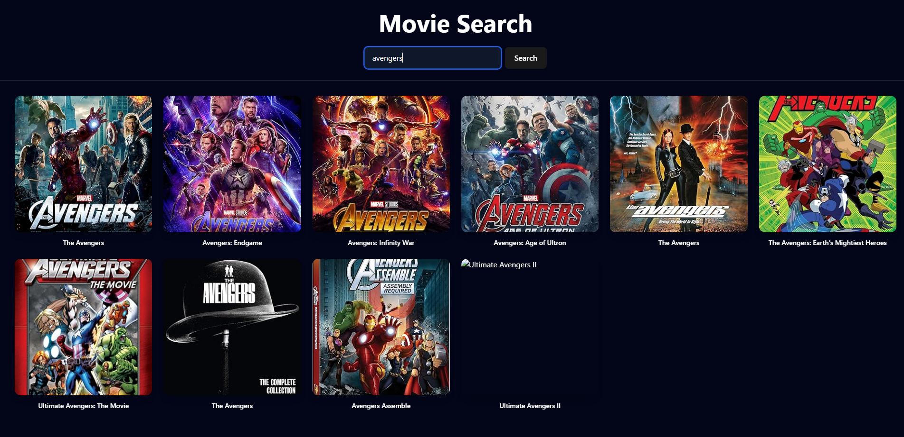

# 🎬 React Movie App

A modern movie search application built with React.  
Users can search for movies and view movie details using the OMDb API.

---

## 🚀 Live Demo

🔗 https://reactmovieappp.netlify.app/

---
## 📸 Preview




---

## 📌 Features

- 🔍 Search movies by title
- 📄 Display movie list with poster and basic information
- 🎥 View movie details
- ⚡ Fast and responsive UI
- 📱 Responsive design (mobile & desktop)

---

## 🛠️ Built With

- React
- Vite
- JavaScript (ES6+)
- TailwindCSS
- OMDb API

---

## 📂 Project Structure

```bash
src/
├── components/
│   ├── SearchBar.jsx
│   ├── MovieList.jsx
│   └── MovieDetail.jsx
├── App.jsx
└── main.jsx
```

---


⚙️ Installation & Setup
Clone the repository:
```
git clone https://github.com/Alireza-rh/React-Movie-app.git
```
Navigate to project folder:
```
cd React-Movie-app
```
Install dependencies:
```
npm install
```
Run the development server:
```
npm run dev
```

Build for production:
```
npm run build
```
---

📬 Contact

GitHub: https://github.com/Alireza-rh

LinkedIn: https://www.linkedin.com/in/alireza-rohani


